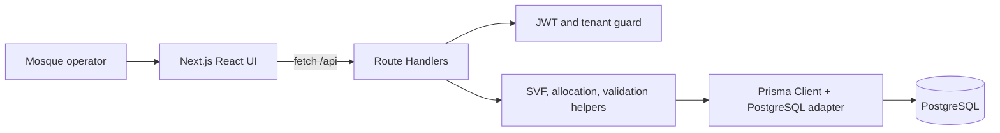
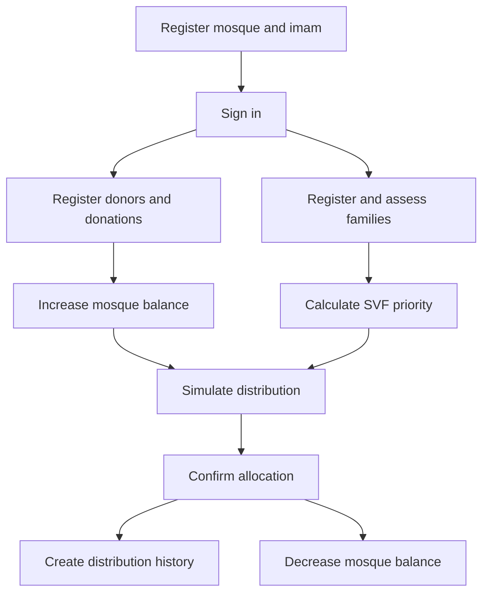

# Project Overview

ZAKAT is a multi-tenant donation-management application for mosques. It records donors and donations, maintains beneficiary-family records, calculates each household's Social Vulnerability Score (SVF), and distributes available funds fairly using a bounded proportional allocation algorithm.

## Problem and users

The application replaces informal, disconnected donation records with a shared operational view of money collected, funds still available, people in need, and assistance already delivered. Its primary operator is an imam or mosque administrator. Donors and beneficiary families are managed records, not self-service user roles in the current implementation.

Each authenticated user is associated with at most one mosque. Nearly all business data is queried through that mosque, which makes the product multi-tenant at the application level.

## What it does today

- Registers an imam and optionally a mosque, then authenticates that imam.
- Manages donor records and named or anonymous donations.
- Maintains a beneficiary-family registry, household members, document attachments, SVF scores, and priorities.
- Tracks mosque balance transactionally when donations or distributions are created, edited, deleted, or reversed.
- Simulates and confirms Water-Filling distributions; stores a distribution history and beneficiary payment states.
- Displays dashboard aggregates and charts.
- Supports French and Arabic with RTL layout, plus light/dark themes.

## Technology

| Concern | Implementation |
| --- | --- |
| Web framework | Next.js 16.2, App Router |
| UI | React 19, Tailwind CSS v4, custom CSS, Radix primitives, Recharts |
| API | Next.js Route Handlers under `src/app/api` |
| Persistence | PostgreSQL, Prisma 7, `@prisma/adapter-pg`, `pg` |
| Authentication | `bcryptjs`, `jsonwebtoken`, HTTP-only JWT cookie with a client Bearer fallback |
| Internationalization | `next-intl`, French and Arabic message files, locale cookie |
| Runtime language | Mostly JavaScript/JSX; selected TypeScript/TSX modules |

## System view

The browser does not call PostgreSQL directly. Client pages use `src/lib/apiClient.js`; route handlers authenticate requests, apply mosque ownership checks, invoke Prisma, and return a common JSON envelope.

## Primary business flow

Read the focused documents for architecture, database, APIs, authentication, donation flow, and the distribution algorithm. Operational setup is in [Developer Guide](Developer_Guide.md).
