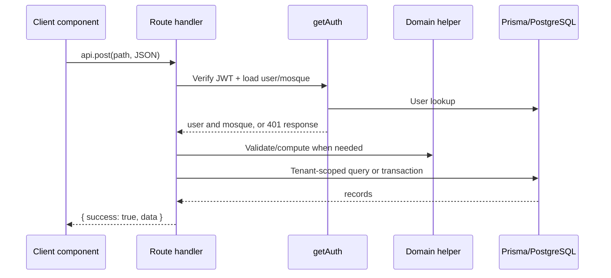

# Architecture

## Application boundaries

The project uses the Next.js App Router. The root layout in `src/app/layout.js` provides document language/direction, global styles, theme initialization, and `NextIntlClientProvider`. Public routes include the landing page, `/login`, and `/register`. Authenticated application pages are grouped in `src/app/(app)`: the parentheses are a route group and do not appear in URLs.

```mermaid
flowchart TB
  Root[src/app/layout.js] --> Public[Public pages]
  Root --> AppLayout[src/app/(app)/layout.js]
  AppLayout --> Dashboard
  AppLayout --> Families
  AppLayout --> Donations
  AppLayout --> Donors
  AppLayout --> Distributions
  AppLayout --> Settings
```

`src/app/(app)/layout.js` is a client-side gate: on mount it calls `GET /api/auth`; success renders the sidebar and page, while failure clears client session storage and redirects to `/login`. There is no Next.js `middleware.ts` and no server-side route/page protection middleware at present. Route handlers independently call `getAuth`, so APIs remain protected even if a user reaches a page URL directly.

## Server and client components

The root layout is an async server component. Most interactive screens and shared dashboard components start with `"use client"` because they use effects, browser storage, forms, charts, modals, or client navigation. Client pages fetch after rendering and explicitly represent loading, empty, and error states.

This is not a separate backend service: Next.js Route Handlers are the backend boundary. They live under `src/app/api/**/route.js` and export `GET`, `POST`, `PUT`, or `DELETE` functions.

## Request lifecycle



`src/lib/apiResponse.js` standardizes successful responses as `{ success: true, data }` and expected failures as `{ success: false, message, ...extra }`. `src/lib/apiClient.js` sends the HTTP-only cookie via `credentials: "include"`; it additionally reads a mirrored token from local storage and sets an `Authorization: Bearer` header as a fallback.

## Persistence and domain services

`src/lib/prisma.js` constructs a Prisma client using `PrismaPg` and a `pg` pool. It keeps one client on `globalThis` during development to avoid hot-reload connection duplication.

Domain behavior is deliberately kept in small libraries rather than page components:

- `src/lib/auth.js`: password hashing, token signing/verification, request authentication, and safe user serialization.
- `src/lib/svf.js`: SVF scoring, priority mapping, defaults, and custom-weight sanitation.
- `src/lib/waterFilling.js`: pure bounded proportional allocation.
- `src/lib/recalc.js`: one-family or mosque-wide SVF recalculation.
- `src/lib/familyMembers.js`: member validation, tenant lookup helpers, and Decimal-safe response mapping.
- `src/lib/format.js`: labels and display formatting.

Financial writes use Prisma transactions. For example, donation creation creates the donation and updates mosque balance and donor total in one transaction. Distribution confirmation creates the header/items, decreases balance, and stamps `lastAidAt` together.

## Authentication and tenancy

Authentication is based on a signed seven-day JWT. The token contains user ID, email, and role; `getAuth` verifies it and reloads the user with their mosque. The code scopes most records by `mosque.id` or by the `MosqueFamily` relation. This is the key tenant-isolation mechanism.

The schema supports `ADMIN` and `IMAM`, but authorization currently confirms authentication and mosque ownership; it does not centralize role-based permission rules. See [Authentication](05_Authentication.md).

## Providers and state

There is intentionally little global client state:

- `Providers.jsx` is an empty extension boundary for future non-i18n providers.
- `SidebarContext.jsx` holds sidebar collapsed state.
- `ToastProvider` from `src/components/ui.jsx` provides local notification UI.
- Auth session mirrors user/mosque/token in browser local storage, while the API remains the source of truth.
- Each screen owns its own fetched data and filter/modal state with React hooks.

Theme is stored/read by `src/lib/theme.js`; an inline initialization script in the root layout applies it before paint. Locale is read from a `locale` cookie by `src/i18n/request.ts`.
