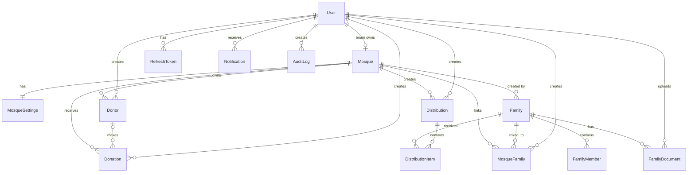

# Database

PostgreSQL is accessed only through Prisma. The source of truth is `prisma/schema.prisma`; migrations under `prisma/migrations/` are the ordered database history. Monetary columns use `Decimal(14,2)` and should not be converted to JavaScript floating-point values for persistence.

## Entity model

## Models and business meaning

| Model | Purpose and important relations |
| --- | --- |
| `User` | An authenticated operator. `email` is unique; one user may own one mosque through `Mosque.imamId`; records refresh tokens, notifications, audit entries, and created business records. |
| `RefreshToken` | Prepared storage for hashed, expiring/revocable refresh tokens. It cascades when its user is deleted; the current login flow does not create or use these rows. |
| `Mosque` | The tenant and financial account. Its unique `imamId` creates a one-to-one owner relationship; `balance` is maintained by donation/distribution transactions. |
| `MosqueSettings` | One optional settings row per mosque (`mosqueId` unique). Stores SVF fields/overrides, distribution minimum/reserve, and policy flags. |
| `Family` | Beneficiary household identity and assessment data. CCP is globally unique. It is created by one mosque and may be linked to many mosques through `MosqueFamily`; holds members, documents, and distribution items. |
| `FamilyMember` | A named household member with a role. The family HEAD is represented as a member row; CHILD rows affect SVF calculation. Deleting the family cascades to its members. |
| `MosqueFamily` | Tenant-family junction with local active state/notes and creator. Composite uniqueness prevents duplicate mosque/family links. |
| `FamilyDocument` | Base64 content plus file metadata for a family, uploaded by a user. It is database-backed, not object-storage-backed. |
| `Donor` | A mosque-owned individual or organization. `totalDonated` is a maintained aggregate; donations remain linked to a donor when identified. |
| `Donation` | A received monetary contribution with category/method/date and optional donor. It increases mosque balance. |
| `Distribution` | A completed/draft/cancelled allocation event with budget, total actually allocated, method, and item lines. It belongs to one mosque. |
| `DistributionItem` | One family allocation within a distribution. It stores immutable SVF/priority snapshots and payment state; one family may appear only once per distribution. |
| `AuditLog` | Schema support for immutable activity records with optional mosque, old/new JSON values, IP and user agent. No route currently writes audit records. |
| `Notification` | Schema support for per-user notifications and read status. Current UI displays a static empty-state; no notification API writes these rows. |

## Foreign keys and delete behavior

Most tenant-owned records cascade when their mosque is deleted (`Donor`, `Donation`, `Distribution`, and `MosqueFamily`). `FamilyMember`, `FamilyDocument`, `RefreshToken`, and `Notification` cascade with their parent. A `DistributionItem` references a `Family` without a cascade rule, preserving a conservative historical dependency. `MosqueFamily` is the authoritative tenant linkage for family access, while `Family.createdByMosqueId` records origin.

## Indexes and constraints

- Unique: `User.email`, `RefreshToken.tokenHash`, `Mosque.email`, `Mosque.imamId`, `MosqueSettings.mosqueId`, `Family.ccp`, and `DistributionItem(distributionId, familyId)`.
- Junction uniqueness: `MosqueFamily(mosqueId, familyId)`.
- Tenant/filter indexes: `Donor.mosqueId`, `Donation.mosqueId`, `Donation.donorId`, `Distribution.mosqueId`, `MosqueFamily.mosqueId`, `MosqueFamily.familyId`.
- Common query indexes: user role; mosque location and verification; family status/priority/wilaya; member family; document family/uploader; donor name/phone/email; donation date/category; distribution date; audit user/mosque/entity/date; notification user/read state.

Indexes improve queries but do not grant isolation. APIs must continue filtering by the authenticated mosque.

## Enums

| Domain | Values |
| --- | --- |
| Users/mosques | `UserRole`: `ADMIN`, `IMAM`; `MosqueStatus`: `ACTIVE`, `INACTIVE`; `VerificationStatus`: `PENDING`, `APPROVED`, `REJECTED` |
| Family | `FamilyStatus`: `ACTIVE`, `INACTIVE`, `ARCHIVED`; `MaritalStatus`: `SINGLE`, `MARRIED`, `WIDOWED`, `DIVORCED`; `EmploymentStatus`: `UNEMPLOYED`, `PART_TIME`, `FULL_TIME`, `RETIRED`, `DISABLED`, `NONE`; `FamilyMemberRole`: `HEAD`, `SPOUSE`, `CHILD`, `PARENT`, `OTHER`; `HousingStatus`: `OWNER`, `TENANT`, `HOMELESS`, `TEMPORARY`; `HousingType`: `HOUSE`, `APARTMENT`, `TEMPORARY`, `OTHER`; `IncomeSource`: `SALARY`, `SOCIAL_AID`, `PENSION`, `SMALL_BUSINESS`, `FAMILY_SUPPORT`, `CHARITY`, `OTHER`, `NONE`; `PriorityLevel`: `URGENT`, `VULNERABLE`, `MODERATE`, `LOW` |
| Finance | `DonorType`: `INDIVIDUAL`, `ORGANIZATION`; `DonationCategory`: `ZAKAT_MAL`, `ZAKAT_FITR`, `SADAQAH`, `KAFFARA`, `OTHER`; `PaymentMethod`: `CASH`, `CCP`, `BANK_TRANSFER`; `DistributionMethod`: `WATER_FILLING`, `MANUAL`; `DistributionStatus`: `DRAFT`, `APPROVED`, `COMPLETED`, `CANCELLED`; `DistributionItemPaymentStatus`: `PENDING`, `PAID`, `CANCELLED` |
| Support | `AuditAction`: `CREATE`, `UPDATE`, `DELETE`, `LOGIN`, `LOGOUT`, `APPROVE`, `REJECT`, `DISTRIBUTE`; `NotificationType`: `SUCCESS`, `INFO`, `WARNING`, `ERROR` |

## Migrations and seeds

The initial migration creates the schema. Later migrations add JSON SVF weights, make `incomeSources` default to an empty enum array, and add/backfill `Family.membersCount` plus missing HEAD member rows. Run `npx prisma migrate dev` locally after schema changes, and `npx prisma migrate deploy` for deployed environments. See [Developer Guide](Developer_Guide.md) for safe commands and seeds.
