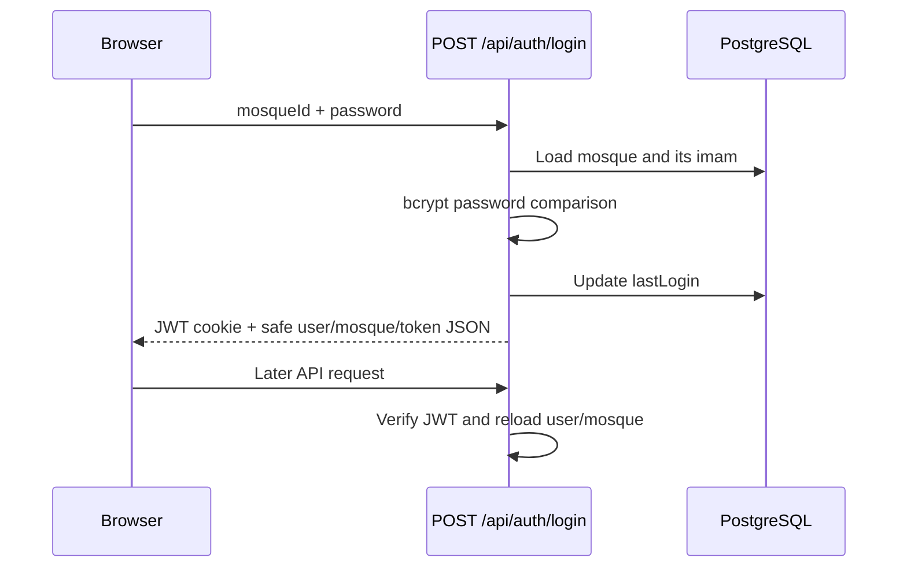
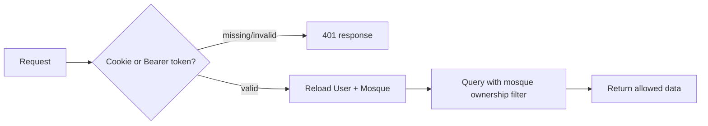

# Authentication and Access Control

## Current design

Authentication is password-based and tied to the mosque selected at login. The active implementation is in `src/lib/auth.js` and the route handlers under `src/app/api/auth/`.

## Registration

`POST /api/auth/register` requires first name, last name, email, and a password of at least eight characters. The registration UI also supplies mosque information. When `mosque.name` is present, the API creates the `User`, `Mosque`, and `MosqueSettings` rows inside one Prisma transaction. New users are currently immediately active; the schema's mosque verification fields are not enforced by the login flow.

The account role is always created as `IMAM`. `ADMIN` exists in `UserRole`, but no administrator provisioning flow or role-specific permission policy is implemented.

## Login, JWT, and cookies

The login screen first discovers a mosque by wilaya, then commune, then mosque ID. `POST /api/auth/login` verifies the selected mosque's linked imam and rejects inactive accounts. A successful result:

- signs a JWT containing `sub` (user ID), email, and role;
- sets the `token` HTTP-only cookie, `SameSite=Lax`, path `/`, for seven days;
- returns the same token, plus a password-safe user and mosque, in JSON.

`getAuth(request)` accepts either the cookie or an `Authorization: Bearer` header, verifies the signature, and reloads the current user and their mosque from PostgreSQL. Every protected API route should call it before accessing tenant data.

The client helper, `src/lib/apiClient.js`, sends cookies and can mirror the token/user/mosque into `localStorage` as a fallback. This duplication is a security and consistency trade-off: an HTTP-only cookie cannot be read by browser JavaScript, whereas a local-storage token is exposed to an XSS compromise. The current login and registration pages do not call `saveSession`; the authenticated app layout subsequently loads user/mosque from `GET /api/auth`, but header display can still fall back to a placeholder until session data is saved.

## Protected routes and tenancy

There is no `middleware.ts`. Page protection is client-side: `src/app/(app)/layout.js` calls `GET /api/auth` after mounting and redirects failures to `/login`. This is a usability gate, not a server-render protection boundary.

Route handlers enforce the real API boundary. Most use the authenticated mosque ID to filter direct tenant-owned records or use `MosqueFamily` relation filters for families and their related records. A client must never be trusted to supply a mosque ID.

## Permissions and logout

The current authorization rule is effectively “authenticated user with access to this mosque.” Although JWTs carry a role and the database declares `ADMIN`/`IMAM`, routes do not perform centralized role authorization. Changes that require an administrator, approval workflow, or account management need explicit role checks.

`POST /api/auth/logout` only expires the current `token` cookie. The `RefreshToken` table is present but not used by login, token refresh, session listing, revocation, or logout-all-devices features. Tokens remain valid until their seven-day expiry unless the signing key changes; `getAuth` does at least reject a deleted user.

## Security gaps to address

- Password change through `PUT /api/auth` now requires the current password and enforces an 8-character minimum, but recovery and verification flows remain absent.
- There is no forgot-password, reset-token, email-verification, rate-limiting, or account-lockout implementation. The login page links to `/forgot-password`, but that route does not exist.
- `JWT_SECRET` falls back to a known development string if unset. Production deployments must reject missing secrets at startup.
- Audit rows are never written for login, logout, or sensitive changes.
- Cookie transport is secure only when `NODE_ENV === "production"`; use HTTPS and production environment configuration in deployment.

See [Known Issues](13_Known_Issues.md) and [Next Team Roadmap](11_Next_Team_Roadmap.md) before extending authentication.
