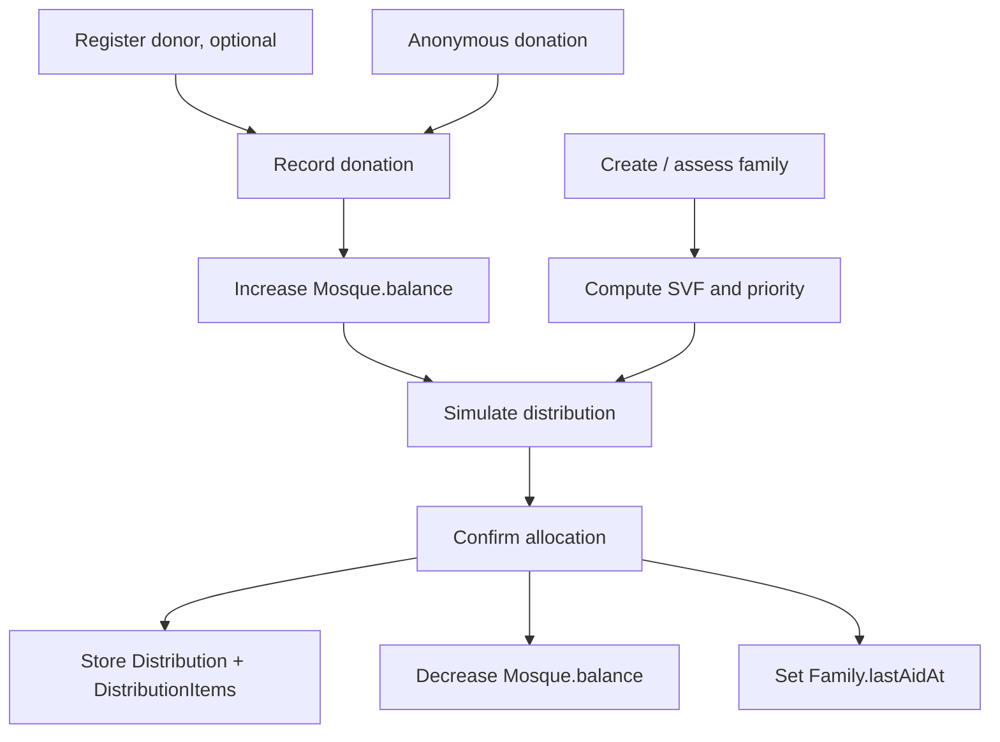

# Donation and Distribution Workflow

## Business lifecycle

The application manages a mosque's operating balance. Donations add money; confirmed or manually recorded distributions subtract money. A family becomes eligible for automated allocation only when it is `ACTIVE` and has an active `MosqueFamily` link for the current mosque.



## Receiving donations

An operator may create a donor through `POST /api/donors`, then create a named donation either via `POST /api/donations` or `POST /api/donors/:donorId/donations`. `POST /api/donations` also supports an anonymous donation. Donations require a positive amount, a category, and a payment method.

For a named donation, the creation transaction creates the donation, increments `Donor.totalDonated`, and increments `Mosque.balance`. Anonymous donations increment only the mosque balance. Editing a donation adjusts both balance and affected donor totals; deleting it is refused when the current balance is already below the donation amount, because the money may have been spent.

The balance is stored as `Decimal(14,2)` in the database. Dashboard totals and some API responses convert it to JavaScript numbers for display, so new financial logic should avoid using display values as an accounting source.

## Family intake and eligibility

`POST /api/families` creates the household, creates the mosque-family link, and guarantees a HEAD `FamilyMember`. The form adds a spouse row when applicable. The API derives an initial SVF score and priority using the mosque's effective scoring weights. Later member changes, family edits, and settings updates can recalculate the score.

The declared household size (`Family.membersCount`) is distinct from the number of individually registered members. It is preserved as an intake declaration; the algorithm uses actual CHILD member rows for the child-scoring input.

## Simulate, then confirm, a distribution

`POST /api/distribution/calculate` is a read-only preview. It selects eligible families, takes a requested budget, applies Water-Filling, and returns proposed allocations, reserve details, and any unallocated amount. It does not modify balance or create history.

`POST /api/distribution/confirm` either accepts posted allocation lines (treated as manual by default) or recalculates Water-Filling. Before writing, it rechecks each family’s active tenant link and checks the latest mosque balance. Its transaction:

1. creates a `Distribution` marked `COMPLETED`;
2. creates one `DistributionItem` per allocation, preserving SVF and priority snapshots;
3. decreases `Mosque.balance` by the total allocated;
4. updates the selected families’ `lastAidAt` timestamp.

```mermaid
sequenceDiagram
  participant UI
  participant Calc as /distribution/calculate
  participant Confirm as /distribution/confirm
  participant DB
  UI->>Calc: budget + optional bounds/family IDs
  Calc->>DB: Load active linked families/settings
  Calc-->>UI: preview; no write
  UI->>Confirm: chosen allocations or budget
  Confirm->>DB: Recheck family eligibility and balance
  Confirm->>DB: Transaction: distribution, items, balance, lastAidAt
  Confirm-->>UI: completed distribution
```

`POST /api/distributions` is a separate shortcut for one manual aid to one linked family. It creates an immediately completed manual distribution and decreases balance. `PUT /api/distributions/:id` can later change distribution status/notes or an item payment status, while `DELETE` reverses the full distribution by restoring `totalDistributed` to the balance and deleting its items.

## History and payment state

Distribution history is available at `GET /api/distributions`; details include each beneficiary item. Each item starts `PENDING` and can be set to `PAID` or `CANCELLED`. The code does not set `paidAt` when an item becomes paid and does not reconcile balance when an item is cancelled. Distribution status changes are also independent of balance movement: records are initially created as `COMPLETED`, including when the settings row says approvals are required.

## Operational invariants

- Never alter `Mosque.balance` outside the same transaction that creates, corrects, deletes, or reverses its financial record.
- Do not distribute to archived, inactive, or unlinked families.
- Preserve `DistributionItem.svfSnapshot` and `prioritySnapshot`; current family data can legitimately change after payment.
- A simulator result is only a proposal. Confirmation must always repeat eligibility and balance checks, as the current API does.

The calculation itself is detailed in [Distribution Algorithm](07_Distribution_Algorithm.md).
