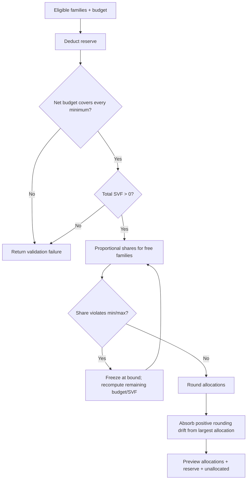

# Distribution Algorithm

The automated allocator is `calculateWaterFilling()` in `src/lib/waterFilling.js`. It distributes a selected budget among eligible active families in proportion to their current SVF score, while respecting a reserve and per-family minimum/maximum amounts.

The implementation comments identify it as a port of an earlier `water_filling.py` approach and explicitly correct a prior unsafe clamp-only implementation. The claims below are based on the present JavaScript code.

## Inputs and defaults

| Input | Default | Meaning |
| --- | ---: | --- |
| Total budget | required | Amount submitted for this distribution simulation. |
| Reserve | 10% | Held out from allocation. `0.1` and `10` both mean 10%. |
| Minimum amount | 1,000 DA | Lowest permitted allocation per family. |
| Maximum amount | 50,000 DA | Highest permitted allocation per family. |
| Family SVF | required positive total | Relative vulnerability weight. |

The calculate API uses `MosqueSettings.reservePercentage` and `minimumDistributionAmount` when the caller does not supply values. A zero configured minimum deliberately falls back to the algorithm default. The maximum is request-only: no max amount is persisted in `MosqueSettings`.

## Relationship to SVF

SVF is the allocation weight, not a currency amount. Family scores are generated in `src/lib/svf.js` from income, actual CHILD member count, marital/no-support status, disability/chronic illness, tenant status, prior aids, and age. Higher current SVF receives a higher proportional share once fixed minimum/maximum allocations are accounted for.

The score is capped between 0 and 100. If all eligible scores total zero, allocation fails rather than inventing an equal split. See `computeSVF()` for scoring rules.

## Reserve and bounded proportional allocation

First, the allocator normalizes reserve values and calculates:

```text
netBudget = totalBudget × (1 − reserve)
reserveAmount = totalBudget − netBudget
```

It rejects no families, a non-positive budget, invalid bounds, a maximum smaller than minimum, a net budget smaller than `minimum × familyCount`, or a non-positive sum of SVF scores.

It then performs real water-filling. Each unfrozen family receives a provisional share of the remaining budget proportional to its SVF. Any share outside a bound is frozen at that bound. The remaining money and remaining SVF are recomputed for the unfrozen families, and the process repeats until none newly violates a bound.



## Pseudocode

```text
validate families, budget, min, max
net = budget * (1 - normalizedReserve)
fail if net < min * numberOfFamilies
fail if sum(SVF) <= 0

mark every family as free with allocation 0
remaining = net
while free families remain:
  give each free family remaining * familySVF / sum(freeSVF)
  freeze allocations above max at max
  freeze allocations below min at min
  if no family was frozen: stop
  remaining = net - sum(frozen allocations)
  fail if remaining < 0

round allocations to two decimals
if rounded sum exceeds net:
  subtract the difference from the largest allocation
return allocations, reserve, total allocated, unallocated amount
```

## Why this improves the old clamp-only behavior

A clamp-only strategy calculates every initial share, independently forces it into `[min, max]`, and stops. Raising low shares can make the total exceed the net budget. Lowering high shares can leave money behind even though other families could receive it. The current loop freezes constrained families and redistributes the remainder across families that are still free, preserving the budget constraint where the bounds permit a solution.

The code also corrects centime-level positive rounding drift by reducing the largest allocation, so the rounded sum does not exceed the net budget. It exposes leftover money as `unallocated` when every family has reached the maximum rather than silently claiming it was distributed.

## Important edge cases

| Situation | Current outcome |
| --- | --- |
| Reserve is negative/non-numeric | Treated as zero. |
| Reserve is `10` | Normalized to `0.1`. |
| Reserve is 100% or more | Capped at 99%, never leaves a literal zero net budget due to reserve normalization. |
| No eligible family | Failure. |
| Net budget cannot pay all minima | Failure; no allocation is persisted. |
| Total SVF is zero | Failure, requesting score correction first. |
| Every family reaches maximum | Result succeeds with a positive `unallocated` amount. |
| Explicit manual allocations | `/distribution/confirm` does not run this algorithm; it sums posted amounts. |

## Boundaries and follow-up work

The configured fields `povertyThresholdPerPerson`, `svfWeightExponent`, `customCriteria`, `svfMaxScore`, and `autoCalculateSVF` are not consulted by `calculateWaterFilling()` or `computeSVF()`. They are persisted through the settings API but currently have no operational effect. Also, confirmation accepts manual allocations without checking that their sum is at most the requested budget; it checks only the mosque’s current balance. These are documented implementation gaps, not implicit rules.
