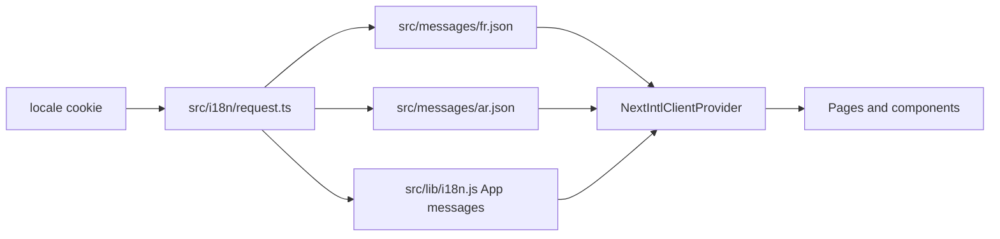

# Internationalization and Theming

## Locale architecture

The application uses `next-intl` with two supported locales: French (`fr`) and Arabic (`ar`). `src/i18n/request.ts` reads the `locale` cookie, validates it against the locale list, and falls back to French. It then loads `src/messages/<locale>.json` and merges the legacy `App` dictionary exported by `src/lib/i18n.js`.

The root layout gets the locale and messages from `next-intl/server`, provides them through `NextIntlClientProvider`, and sets the document `<html lang>` value. Use `useTranslations("Namespace")` in client components. Some older management screens use `useTranslations("App")`; new work should prefer clearly scoped namespaces in the JSON catalogs.

## Language switching and RTL

`src/components/Topbar.jsx` changes language by writing a one-year `locale` cookie and calling `router.refresh()`. The current page then reloads under the selected locale. The root layout sets `dir="rtl"` for Arabic and `dir="ltr"` for French, so layout CSS should use logical properties (`margin-inline-start`, `padding-inline`, and similar) where direction matters.

The public login and registration pages also read the locale and explicitly pass direction to their page containers. The application does not have locale-prefixed URLs such as `/ar/dashboard`; the locale is entirely cookie-driven.

## Catalogs and translation conventions

- `src/messages/fr.json` and `src/messages/ar.json` contain the main nested catalogs for landing, login, registration, settings, and shared UI.
- `src/lib/i18n.js` contains a legacy flat French-to-Arabic `App` map used by the dashboard-side components. Its flat keys must not contain a dot because `next-intl` treats dots as namespace separators.
- New UI strings need equivalent keys and compatible placeholders in both JSON files. Do not assume a French fallback exists.

The Settings page currently has translated labels in the catalog but does not persist or load settings; translation coverage does not mean a feature is operational.

## Theme architecture

Light/dark preference is separate from locale. `src/lib/theme.js` reads/writes the `theme` local-storage key. It applies both `data-theme="light"` for the management-app CSS and the `.dark` class used by Tailwind's dark variants on the landing UI. An inline script in `src/app/layout.js` applies the stored theme before first paint.

`Topbar` and the landing-page theme control share that helper and emit a browser `themechange` event so mounted controls stay synchronized. Theme choice is not stored in the database and does not follow the user across devices.

## Testing checklist

For each new screen or component, verify:

- French and Arabic labels, interpolation, validation messages, and empty states;
- right-to-left ordering, icons, spacing, tables, modals, and input alignment;
- both light and dark themes;
- a missing/invalid locale cookie (French fallback);
- no hard-coded user-facing strings that remain French in Arabic mode.

The codebase has mixed translation styles and a number of hard-coded strings, particularly within forms and error messages. Treat complete bilingual coverage as ongoing work.
