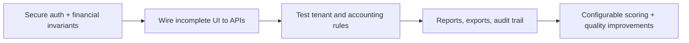

# Next Team Roadmap

The phases below prioritize correctness, privacy, and financial traceability before new presentation features. Complexity is an implementation estimate, not a delivery commitment.

## Phase 1 — Critical correctness and security

| Priority | Work                                                                                                                            | Complexity | Why now                                                                                                 |
| -------- | ------------------------------------------------------------------------------------------------------------------------------- | ---------- | ------------------------------------------------------------------------------------------------------- |
| P0       | Require a production `JWT_SECRET`; remove the unsafe fallback outside local development.                                        | Low        | Prevents predictable authentication secrets.                                                            |
| P0       | Enforce persisted settings policies and keep account/profile workflows robust.                                                  | Medium     | Settings loading and saving are wired, but policy flags and related business logic still need coverage. |
| P0       | Add current-password verification, password rules, reset-password flow, rate limiting, and audit logging for sensitive actions. | High       | Protects operator accounts and financial records.                                                       |
| P0       | Define and enforce a distribution state machine, including approval policy and payment/settlement effects.                      | High       | Current `COMPLETED` creation and later status edits can be semantically inconsistent.                   |
| P0       | Validate manual allocation lines: positive finite amounts, unique family IDs, and total-vs-budget/business-rule checks.         | Medium     | Prevent malformed or unintended financial distributions.                                                |
| P1       | Ensure `paidAt` is set appropriately and specify cancellation/reversal rules for item payments.                                 | Medium     | Makes payment history usable and auditable.                                                             |

## Phase 2 — Complete core operations

| Priority | Work                                                                                                              | Complexity | Notes                                                          |
| -------- | ----------------------------------------------------------------------------------------------------------------- | ---------- | -------------------------------------------------------------- |
| P1       | Deliver family-document UI and define size/type limits; consider object storage rather than Base64 in PostgreSQL. | Medium     | Routes are already present.                                    |
| P1       | Implement mosque profile update and consistent account-session display.                                           | Medium     | Requires route, validation, and UI work.                       |
| P1       | Implement donor soft delete or an archival policy.                                                                | Low        | Current deletion is intentionally blocked when history exists. |
| P1       | Make anonymous-donation and approval setting flags operational.                                                   | Low        | Persisted values currently do not control routes.              |
| P1       | Add a safe, versioned SVF configuration model; either activate/remove unused settings fields and custom criteria. | High       | Avoid dynamic-code execution; preserve explainability.         |
| P1       | Add API and domain tests for balance mutations, tenant isolation, SVF boundaries, and Water-Filling bounds.       | High       | Financial logic requires regression protection.                |

## Phase 3 — Reporting, administration, and quality

| Priority | Work                                                                                                                    | Complexity | Notes                                                       |
| -------- | ----------------------------------------------------------------------------------------------------------------------- | ---------- | ----------------------------------------------------------- |
| P2       | Create reports with filterable statistics and PDF/Excel exports.                                                        | High       | Define source-of-truth accounting first.                    |
| P2       | Add mosque-scoped backup/export and carefully authorized restore procedures.                                            | High       | Include attachment/data-retention strategy.                 |
| P2       | Add a separate, resettable demo environment/tenant.                                                                     | Medium     | Never reuse production data.                                |
| P2       | Use `AuditLog` and `Notification` end-to-end; add a real notification UI.                                               | Medium     | Build on security/event work.                               |
| P2       | Establish CI: lint/format, unit/integration tests, Prisma validation, production build, and dependency/security checks. | Medium     | The repository currently has no test/lint/CI configuration. |
| P2       | Consolidate duplicate/legacy UI systems and remove/archive backup snapshots outside deployable source.                  | Medium     | Reduces maintenance confusion.                              |

## Suggested delivery sequence

Before each production change, use a migration review, seed-independent test data, a tenant-isolation review for every query, and a documented reversal/rollback plan for financial records.
