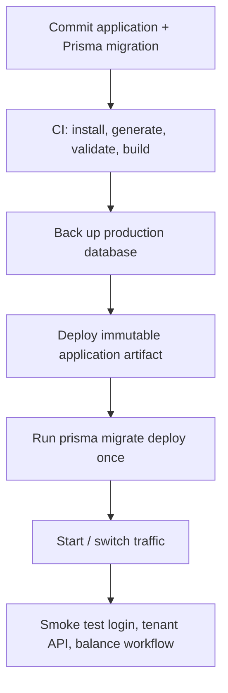

# Deployment and Operations

## Runtime requirements

The application is a Next.js server backed by PostgreSQL. It requires a Node.js runtime compatible with the pinned Next.js/Prisma versions, a reachable PostgreSQL database, and environment configuration before building or starting.

| Variable | Required | Purpose |
| --- | --- | --- |
| `DATABASE_URL` | Yes | PostgreSQL connection string for Prisma, the `pg` pool, migrations, and seeds. |
| `JWT_SECRET` | Yes in deployment | Long, unique secret used to sign seven-day JWTs. Do not rely on the source fallback. |
| `NODE_ENV` | Set by host | Enables secure cookies when `production`. |

Use a managed secret store or deployment-platform environment variables. Never commit `.env` files, seed passwords, or production database URLs.

## Deployment flow



Recommended commands in a clean build environment:

```bash
npm ci
npx prisma generate
npx prisma validate
npm run build
```

Apply committed migrations to a production database with:

```bash
npx prisma migrate deploy
```

Do not run `prisma migrate dev` or `npm run db:reset` against production. `db:reset` is destructive. Do not use either seed script in production; `prisma/seed.js` contains sample credentials/data and `seed-families.js` inserts test families.

## Database and migrations

`prisma/schema.prisma` is the source schema and `prisma/migrations/` is the ordered history. Review generated migration SQL before it reaches a shared environment, especially operations that alter required columns or relationships. Backfill existing rows in the migration rather than assuming a clean database.

The generated client is emitted into `src/app/generated/prisma/` and is intentionally ignored by Git. The build script runs `prisma generate` before `next build`; never hand-edit generated output.

## Reverse proxy and cookies

Serve the site over HTTPS. `POST /api/auth/login` uses `secure: process.env.NODE_ENV === "production"` for the JWT cookie, so a proper production runtime configuration is necessary. Place Next.js behind a reverse proxy/load balancer that preserves HTTPS and forwards host/protocol headers correctly. Set a restrictive content-security policy and security headers at the host/proxy level; none are configured in `next.config.mjs` today.

Because the app uses cookie sessions, run all application instances with the same `JWT_SECRET`. Because it creates a `pg` pool in each Node process, size application instances and database connection limits together.

## Data, backups, and observability

Before migrations and releases, take a tested PostgreSQL backup. Current family documents are stored as Base64 in the database, so database backup/restore includes them but can become large. There is no built-in application backup/export, monitoring, alerting, structured logging, health endpoint, or error tracking. Add these before relying on the service operationally.

At minimum, monitor process availability, database connectivity/pool usage, failed authentication attempts, 5xx response rates, and balance/distribution transaction failures. Ensure production logs do not expose JWTs, passwords, database URLs, or document contents.

## Post-deploy smoke test

1. Confirm the landing page, login, and registration display in French and Arabic.
2. Sign in with a non-production test account and verify `GET /api/auth` succeeds.
3. Create a controlled donation and check the balance changes once.
4. Simulate a distribution, then confirm it only in a test tenant; check distribution history and balance.
5. Check a restart or second instance preserves login behavior.
6. Verify migration status and application logs before declaring the release complete.
